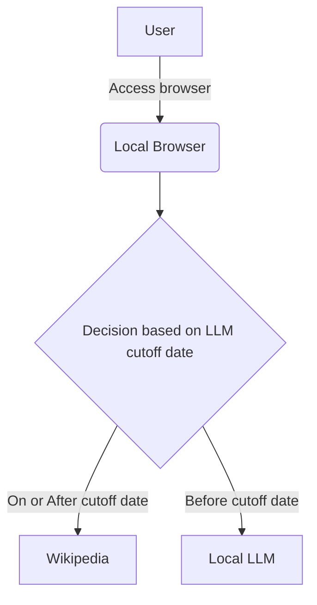

# Secure, free, and personalized Generative AI assistant on a personal computer


Since the release of ChapGPT in 2022, we have been surrounded by an explosion of generative AI (GenAI) solutions available in the public domain. Most people use sites like ChatGPT, Gemini, Copilot, Perplexity, and others to create content using GenAI solutions.

There are three key challenges with using public domain GenAI sites:
* **Security**: Users are at the mercy of the GenAI sites for the security, storage, and usage of the queries and other content posted on these sites.
* **Cost**: Most popular GenAI sites allow free content generation up to a certain limit and require a paid subscription for everything beyond the free limit.
* **Lack of Personalization**: The content generated by the GenAI sites is based on publicly available content on the Internet and is not personalized for the user.

While most people are aware of these challenges, the risks of exposing personal information and subsequent exploitation are high, especially while there are limited laws and regulations to protect consumers.

So, I decided to build a personalized GenAI solution to run on a personal computer without worrying about data security and expensive fees.

## Solution Overview ##
The solution is simple. It is a web application running on a local machine that uses free and open-source LLM running on a local machine to provide answers to user queries. All LLMs have cutoff dates for data, so the solution is built to query [Wikipedia](https://www.wikipedia.org) for queries that can not be answered by LLM due to cutoff date limitation.



## Steps to create Gen AI assistant ##

This section describes three steps to complete the setup of above solution.
1. Install [Python](https://www.python.org) (free and open source high-level, general-purpose programming language)
2. Install [Ollama](https://ollama.com) (free and open source platform to run LLMs on a local machine) and download [Llama](https://www.llama.com) (free and open source LLM by Meta AI) on a local machine
3. Create a local web application using Python to access a local LLM instance and Wikipedia

### Step #1: Install Python
* Download and run the Python Windows installer from the [URL](https://www.python.org/downloads/windows) 
* Follow the installer instructions to complete installation, and select the option to Add Python to PATH when asked during installation.

### Step #2: Install Ollama and Llama LLM
* Download and run Ollama Windows installer from the [URL](https://ollama.com/download/windows)
* Download and install Llama LLM by using the following command on Windows Command Prompt
```
ollama pull llama3.2
```

### Step #3: Create Web Application
* Create a folder on a local machine and open the folder in Windows Command Prompt
* Install Python libraries (streamlit and langchain ollama) using following commands
```
python -m ensurepip --upgrade
pip install streamlit requests langchain-ollama langchain-core
```
* Download Python script named assistant.py in this repo and put it in the newly created folder
* Run local web application by running the following command on Windows Command Prompt
```
streamlit run assistant.py
```
* Access application using the URL http://localhost:8501
* Test the application by posting query on the webpage (e.g., query: What is the Large Language Model?)
* Test the application by posting query that will go beyond cutoff date for Llama LLM and will be answered by providing Wikipedia search results (e.g., As of 2025, who is the president of the USA?)

I hope this guide helps you to build your local free, secure, and personalized generative AI assistant.
